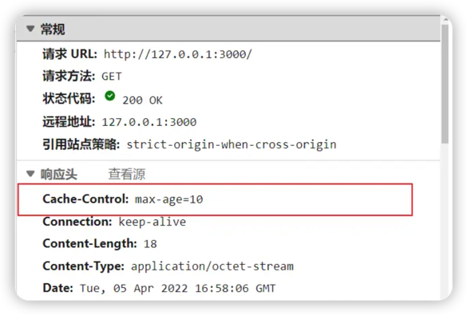
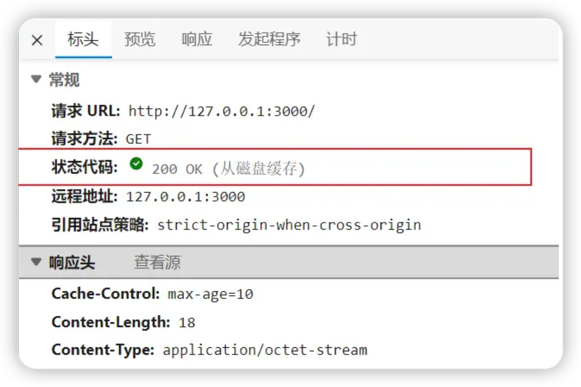

---
category:
- 前端
tag:
- 浏览器
order: 1

permalink: /developer/web/browser/浏览器缓存.html
---

# 浏览器缓存

浏览器缓存是浏览器在本地磁盘对用户近期请求过的文档进行存储。在下一次访问同一文档时，就可以直接从本地磁盘中读取。

其主要过程为：

1. 浏览器第一次加载资源，服务器返回200，浏览器从服务器下载资源文件，并缓存资源以及response header（响应头信息），以供下次对比使用
2. 浏览器再次请求资源，由于强制缓存优先级高，浏览器通过强制缓存判断缓存是否命中，命中则直接使用本地缓存。
3. 强制缓存没有命中则开始判断协商缓存，浏览器会重新发服务器发起请求，携带上判断协商缓存需要的信息给服务器，服务器接收到信息，判断是否命中协商缓存。
4. 命中协商缓存则返回状态码304，浏览器接收到则使用本地缓存。没有命中服务器直接发送新的资源文件给浏览器。

这里大家注意到，浏览器缓存分为了两种：`强制缓存`和`协商缓存`，下面我们来详细了解以下浏览器与服务器是如何进行这两种缓存判断的

## 强制缓存

强制缓存是利用http响应头中的`Expires`和`Cache-Control`两个字段来控制的。

当浏览器第一次请求资源时，服务器返回资源的同时，在响应头中会返回`Expires`和`Cache-Control`
字段，这两个字段的作用是告诉浏览器，这个资源在多久之前是有效的，可以直接使用，不需要再次请求。

### Expires属性

`Expires`属性是http1.0的属性，用来指定资源的过期时间。浏览器再次访问资源时，通过`Expires`
属性判断资源是否在过期时间内，当在过期时间内时，则该资源可以被直接使用。

但是由于时区等原因，`Expires`存在一些问题。

### Cache-Control属性

`Cache-Control`是http1.1的属性，优先级高于`Expires`属性，它有多个不同的值，如：

- `public`：所有内容都将被缓存（客户端和代理服务器都可缓存）
- `private`：所有内容只有客户端可以缓存，`Cache-Control`的默认取值
- `no-cache`：限于服务端确定资源是否发生变化，再决定是否使用缓存，也就是协商缓存
- `no-store`：所有的内容都不会被缓存，即不使用强制缓存也不使用协商缓存
- `max-age=xxx`：`xxx`为数字，缓存内容将在`xxx`秒后失效，即在`xxx`秒内再次发送请求，则会直接使用缓存

这里我们展示一个`Cache-Control`的例子：

设置Cache-Control为`max-age=10`，表示资源在10秒内有效，即在10秒内再次请求资源，则会直接使用缓存。
{class="img-center"}

之后我们10秒内再次请求，可以看到命中缓存，直接使用本地缓存。
{class="img-center"}

## 协商缓存
当命中强制缓存时，浏览器无序向服务器发起请求，直接使用本地缓存。

而协商缓存则是由浏览器发起请求到服务器，请求头上携带着上次请求的响应头信息，服务器根据请求头信息判断资源是否有更新，如果没有更新则返回304状态码，浏览器直接使用本地缓存。

协商缓存主要是通过`Last-Modified/If-Modified-Since`或`Etag/If-None-Match`来判断资源是否有更新。

### Last-Modified和If-Modified-Since
`Last-Modified和If-Modified-Since`是通过时间来判断是否有更新的。

服务器在响应头中添加`Last-Modified`属性来指出资源的最后一次修改时间，当浏览器下一次发起请求时，会在请求头中添加一个`If-Modified-Since`的属性，值为上一次资源返回的最后修改时间。当请求发送到服务器中，服务器会对比来判断资源是否修改。

### Etag和If-None-Match
`Etag和If-None-Match`是通过标识来判断资源是否有更新的。

服务器在响应头中添加`Etag`属性，这个属性是资源生成时的唯一标识符。当浏览器下一次发起请求时，会在请求头中添加`If-None-Match`的属性，值为上一次资源返回的Etag。当请求发送到服务器中，服务器对比来判断资源是否修改。

## 强制缓存和协商缓存区别
- 强制缓存是由浏览器来判断缓存是否生效，一旦命中，不会发起新的请求
- 协商缓存是浏览器发起请求，由服务器来判断缓存是否命中缓存，如果命中则返回304，告知浏览器缓存可使用，没命中则会返回新的资源

## 点击刷新按钮或者按F5、按Ctrl+F5、地址栏回车有什么区别
- 点击刷新、按F5：浏览器直接对本地的缓存文件过期，但是会带上If-Modified-Since，If-None-Match，也就是进行协商缓存
- Ctrl+F5：浏览器直接请求资源，相当于第一次加载页面
- 地址栏回车：浏览器发起请求，按照正常流程，强制缓存协商缓存

---
