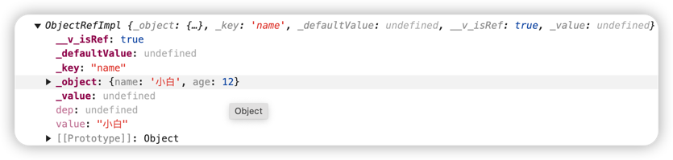
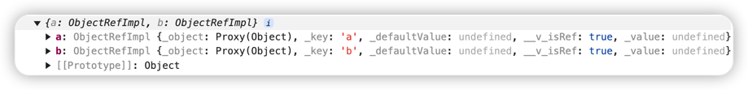

---
category:
- 前端
tag:
- Vue3
permalink: /developer/web/vue/vue3/ref和reactive相关.html
---

# 一文搞懂ref、reactive、toRef、toRefs..

在 Vue3 中，有许多与响应式相关的函数，例如 toRef、toRefs、isRef、unref等等。合理地使用这些函数可以在实际开发中大大提高效率。本文将详细介绍这些函数的用法，让我们在实际开发中知道应该使用哪些 API。并能够熟练地回答面试官的相关问题。

## ref()

ref(),vue3响应式变量声明Api，他接受一个参数，返回一个响应式对象。我们通过.value来访问以及修改值。在模版中，我们可以省略.value

```vue
<template>
  <div> {{ count }}</div>
</template>

<script setup>

const count = ref(1)

const add = () => {
    count.value++
}
</script>
```

## reactive()
reactive()，Vue3用于创建响应式变量的Api。与ref不同，reactive主要用来将复杂对象（如数组、对象），处理成响应式对象，使得对象内部所有的属性都具有响应性。

```vue
<template>
  <div>{{ people.name }}</div>
</template>
<script setup>

const people = reactive({
  name: '小米',
  age: 18
})

const changeName = () => {
    people.name = '大米'
}
</script>
```

### ref与reactive区别
- ref通常用来声明基础类型变量，他的访问和修改值都需要通过.value来进行
- reactive通常用来声明复杂类型变量，声明之后直接对其整体进行赋值会丢失其响应式

## toRef
toRef可以对对象的某个属性进行响应式声明，并保持源对象对其的应用关系

```vue
<template></template>
<script setup>
const people = {
    name: '小白',
    age: 12
}
const peopleName = toRef(people, 'name')
console.log(peopleName)
</script>
```
这里我们在控制台打印peopleName
{class="img-center"}

可以发现peopleName实际上是一个对象，内部存储了原本的people对象以及声明它时使用的key，此时我们访问、修改peopleName需要用到.value， 并且peopleName修改时，people中的值也会改变

## toRefs
toRefs将一个响应式对象转成普通对象，然后对其每一个属性进行ref响应式声明

```vue
<script setup>
const data = reactive({
    a: 1,
    b: 2
})
const newData = toRefs(data)
console.log(newData)
</script>
```
{class="img-center"}

根据它的特性，我们通常用它来解构一个响应式对象，而使其不丢失响应式
```vue
<script setup>
const data = reactive({
    a: 1,
    b: 2
})

const { a, b} = toRefs(data)
// 此时a、b依然保持与原对象的引用关系
</script>
```
## isRef、isReactive
从来判断一个变量是否是ref或者reactive

```vue
<script>
import { reactive, isRef, ref, isReactive } from "vue";
const count = ref(1);
const testObj = reactive({
    a: 1,
});
console.log(isRef(count)); //true
console.log(isRef(testObj)); //false
console.log(isReactive(testObj)); // true
</script>
```

## unref()
unref实际上是一个语法糖
```js
data = isRef(data) ? data.value : data
```
如果是ref，则返回其内部的值，否则则返回其本身


